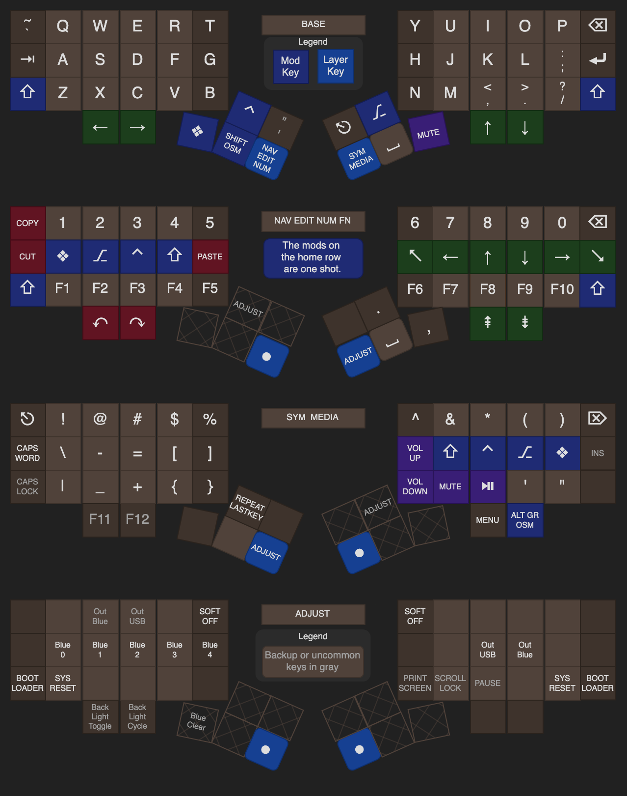

# Hillside Dactyl 50 ZMK firmware

This is the default [ZMK](https://zmk.dev/) firmware for the
    [Hillside Dactyl 50](https://github.com/mmccoyd/hillside_dactyl_50)
    keyboard.
It features:

-   A simple QWERTY keymap using three main layers and one adjust layer. 
-   Nice!view display and the bare LED enabled by default.
-   [ZMK Studio](https://zmk.dev/docs/features/studio) is supported
    but disabled.
    If desired, it needs to be enabled in
    [build.yaml](https://zmk.dev/docs/features/studio#building)
    and added to the
    [keymap](https://zmk.dev/docs/features/studio#keymap-changes).
-   A hardware testing layer that can be uncommented to enable easier one sided
    and layer-free access to functions for hardware build testing.

The detailed keymap choices are similar to those for the
    [Hillside 52](https://github.com/mmccoyd/hillside/wiki/Hillside%2052%20Keymap)
    keymap.

This repo is a module that can be included into an individual's personal
    ZMK configuration.

## See also

### ZMK module repo setup

The user default files were created by following:

- [Configuration Overview](https://zmk.dev/docs/config)

The ZMK guides used for this module based configuration:

- [New keyboard shield guide](https://zmk.dev/docs/development/new-shields)
- [RGB Underglow](https://zmk.dev/docs/features/underglow#adding-rgb-underglow-to-a-board)
  Using the nice!nano two-part pin numbers, not the Arduino ones.

I also cribbed module repo structure from sadekbaroudi's
[fingerpunch repo](https://github.com/sadekbaroudi/zmk-fingerpunch-keyboards).
